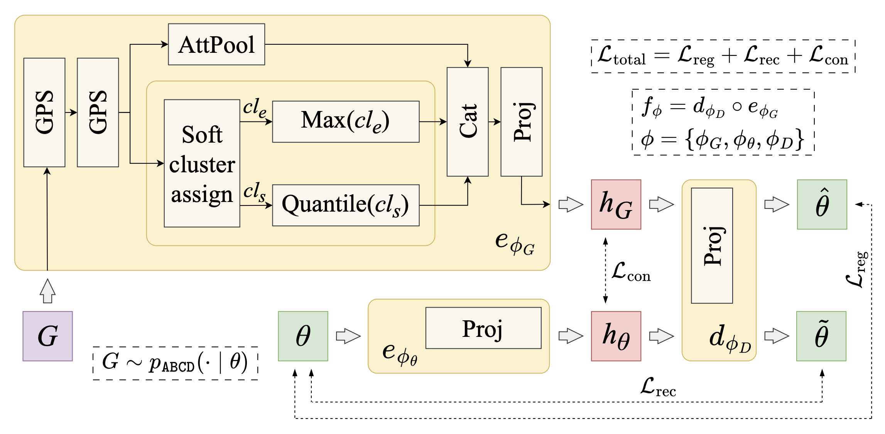

# DCBA

This repository contains the model code for the paper: "Graph Data Augmentation via Contrastive
Generator Inversion (DCBA)" accepted to the 5th Learning on Graphs Conference (Boston, USA, 2026).
The data set, its generators, and the loaders used here live in a companion repository:
[DCBA-data-set](https://github.com/network-science-lab/DCBA-data-set).

## Problem

Given a graph `G`, recover the parameter vector `θ` of the ABCD generator that could have produced
it:

```
G -> Trained Model -> θ  (ABCD parametrisation)
```

This inverts the generator, which makes it possible to augment graph data, model macro-level
interventions on a networked system, and compress a graph to a handful of interpretable parameters.

## Runtime configuration

1. Clone this repository and [DCBA-data-set](https://github.com/network-science-lab/DCBA-data-set)
   into the same parent directory — `dcba-data-set` is consumed as an editable path dependency
   (`../DCBA-data-set`).
2. Install [uv](https://docs.astral.sh/uv/getting-started/installation/), then sync the environment
   from the repository root:
   ```bash
   uv sync
   ```
   The default configuration targets CUDA 12.1; the CPU-only alternatives are commented in
   `pyproject.toml`.
3. Pull the data (see the `DCBA-data-set` README for DVC and Google Drive access):
   ```bash
   dvc pull
   ```
4. Copy `.env.example` to `.env` and fill in `WANDB_API_KEY` and `DCBA_DATA_ROOT` (the `data`
   directory of `DCBA-data-set`).
5. Install `pre-commit`:
   ```bash
   uv run pre-commit install --config .pre-commit-config.yaml
   ```
   This tool will automatically check code formatting and run tests before each commit. To skip
   checks, use `git commit --no-verify`; to scan all files execute:
   `uv run pre-commit run --all-files --config .pre-commit-config.yaml`.

## Model



A GPS encoder maps a graph `G` to an embedding `h_G`, while an MLP autoencoder maps a generator
configuration `θ` to `h_θ`. Both encoders are trained jointly using a multi-positive supervised
contrastive objective that aligns each configuration with all graphs sampled from it. Since `θ` is
continuous, negative pairs are weighted softly according to their distance in the configuration
space. A decoder head then predicts `θ_hat` directly from `h_G`. In this way, a graph and its
underlying generator configuration are treated as two modalities of the same object, following the
general idea behind [CLIP](https://github.com/openai/CLIP).

Because the generator is stochastic, each configuration `θ` is represented by multiple independently
sampled graphs. The training, validation, and test splits are therefore defined at the configuration
level rather than at the graph level. Splitting individual graphs would introduce leakage by
allowing the model to be evaluated on configurations already encountered during training.

## Running the code

Inference:

```bash
uv run python scripts/example_inference.py
```

The script builds an LFR benchmark graph with networkx, rebuilds the architecture from the matching
config, and prints the recovered config next to the parameters LFR was asked for. Swap models with
the `MODEL` constant at the top to chose one of the following experiments:

| `MODEL`                           | Node features          |
| --------------------------------- | ---------------------- |
| `gps-ae-supcon-log-scaler`        | `ConstantNodeFeatures` |
| `gps-ae-supcon-log-scaler-comm`   | `CommunityToSize`      |
| `gps-ae-supcon-log-scaler-comm-b` | `CommunityToSize`      |

The first was trained with constant node features, so it reads nothing but the graph structure and
applies to any edge list; the other two take a community label per node.

Training:

```bash
uv run dcba-train --config-name gps-ae-supcon-log-scaler
```

All experiment configurations are in `configs/`. To resume a run, pass a Lightning checkpoint and,
optionally, the W&B run id to continue logging into the same run:

```bash
uv run dcba-train --config-name gps-ae-supcon-log-scaler \
  hydra.run.dir=.trainings/2026-07-17/11-51-46 \
  +training.ckpt_path=.trainings/2026-07-17/11-51-46/checkpoints/last.ckpt \
  +training.logger.id=ss4h8yng
```

Per-variable regression diagnostics for a finished run — metrics (e.g. R^2) and plots for each of
the 9 ABCD parameters, uploaded back to the run as a PDF report and a `wandb.Table`:

```bash
uv run python scripts/analyse_predictions.py <entity>/dcba/<run_id> --within-k 1
```

To evaluate a trained run on a data set other than the one it was trained on, recompute its
predictions locally first and then analyse them offline:

```bash
uv run python scripts/compute_test_predictions.py <run_id> --datasets abcd-borderline abcd-big
uv run python scripts/analyse_predictions.py \
  --predictions-file .analysis/<run_id>/predictions_abcd-borderline.table.json \
  --dump-dir .analysis/<run_id>/report-abcd-borderline \
  --within-k 1
```

The run's own data set is evaluated on its logged test split; any other data set, unseen by the run,
is evaluated in its entirety. Both scripts need a W&B API key and the data already pulled with
`dvc pull`.

## Citing the code

If you use the code, please consider citing us:

```bibtex
@inproceedings{stolarski2026dcba,
   title={Graph Data Augmentation via Contrastive Generator Inversion (DCBA)},
   author={
      Stolarski, Mateusz and Czuba, Micha{\l} and Krai\'{n}ski, \L{}ukasz and Musial, Katarzyna and
      Pra\l{}at, Pawe\l{} and Kami\'{n}ski, Bogumi\l{} and Br{\'o}dka, Piotr
   },
}
```

## Acknowledgement

This research was partially supported by: (1) National Science Centre, Poland, grant no.
2022/45/B/ST6/04145; (2) Polish National Agency for Academic Exchange, Strategic Partnerships, grant
no. BPI/PST/2024/1/00129/U/00001; (3) Wrocław Tech, Academia Professorum Iuniorum. Views and
opinions expressed here are those of the authors only and do not necessarily reflect those of the
funding agencies.
